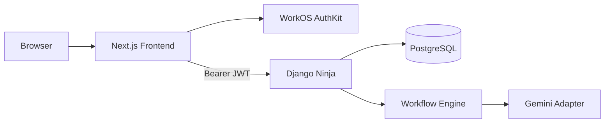

# 01 — Product Architecture

## Product statement

**OpsPilot AI** turns repetitive internal knowledge work into task-oriented AI automation.

Users choose a workflow, provide familiar work information, and receive a structured artifact.

The product deliberately hides:

- RICO
- prompt engineering
- system prompts
- JSON schemas
- model configuration details

## Initial workflows

### Bug / Issue Triage

Input:

- issue title
- affected area
- observed behavior
- expected behavior
- known evidence
- optional settings
- optional constraints

Output:

- summary
- confirmed facts
- evidence gaps
- likely category
- recommended checks
- confidence
- human-review notice

### Meeting → Action Items

Input:

- meeting title
- notes
- optional participants
- optional date

Output:

- meeting summary
- decisions
- action items
- owners only when supported
- deadlines only when supported
- open questions
- unresolved items

### Work → Status Update

Input:

- rough notes
- audience
- format

Output:

- completed
- in progress
- blocked/waiting
- next steps
- shareable update

## Monorepo

```text
OpsPilot-AI/
├── frontend/
├── backend/
├── docs/
├── AGENTS.md
└── render.yaml
```

The services deploy independently.

## Runtime target



## Frontend owns

- public site
- app shell
- WorkOS UI/session later
- workflow forms
- demo fixtures
- live execution states later
- results
- history later
- settings later

## Django owns later

- WorkOS JWT verification
- local users
- canonical workflow registry
- prompt compilation
- Gemini provider calls
- structured validation
- workflow runs/history
- authorization

## Public routes

```text
/
/product
/security
/sign-in later
/auth/callback later
```

## App routes

Part 1:

```text
/app
/app/workflows
/app/workflows/bug-triage
/app/workflows/meeting-actions
/app/workflows/status-update
```

Part 2:

```text
/app/history
/app/history/[runId]
/app/settings
```

Do not display routes before they are implemented.

## Visual identity

Concept:

> **Scattered work becomes clear action.**

Visual language:

- fragments
- lanes
- transformation
- structured artifacts
- subtle signal movement
- strong hierarchy
- generous but not wasteful spacing

Product should feel:

- mature
- useful
- polished
- responsive
- modern
- internally credible

Avoid:

- generic AI chat bubbles
- cyberpunk design
- random stock photography
- unmodified template UI
- excessive purple gradients
- giant empty SaaS dashboards
- fake typing animation

## Greenfield priority order

```text
design system
→ visible pages
→ all workflow forms/results
→ Demo Mode
→ auth/live frontend
→ Django
→ Gemini
→ deployment
```

This order optimizes the hackathon for visible value without sacrificing clean architecture.
