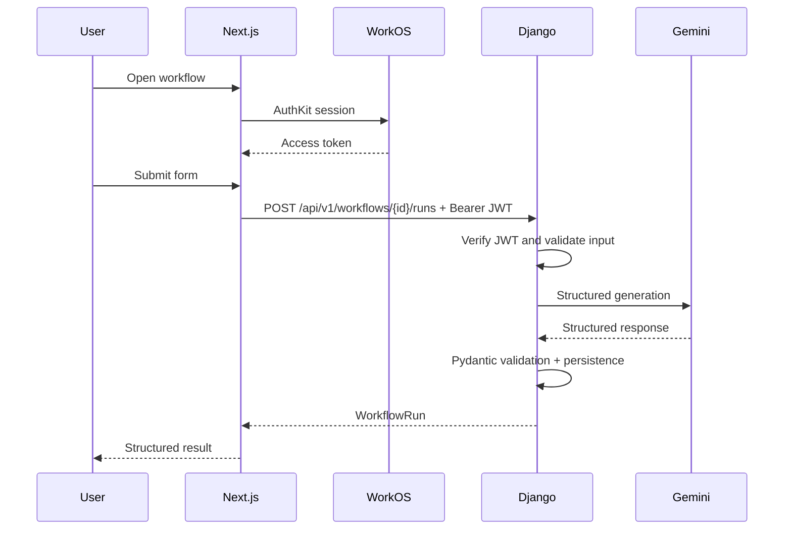

# 06 — End-to-End Integration and Deployment

## Final request flow



## Frontend environment

```text
NEXT_PUBLIC_API_BASE_URL=http://127.0.0.1:8000

WORKOS_CLIENT_ID=
WORKOS_API_KEY=
WORKOS_COOKIE_PASSWORD=
NEXT_PUBLIC_WORKOS_REDIRECT_URI=http://localhost:3000/auth/callback
```

Never put the WorkOS API key in a `NEXT_PUBLIC_` variable.

## Backend environment

```text
DJANGO_SECRET_KEY=
DJANGO_DEBUG=true
DATABASE_URL=
FRONTEND_ORIGIN=http://localhost:3000

WORKOS_CLIENT_ID=
WORKOS_ISSUER=
WORKOS_JWKS_URL=

GEMINI_API_KEY=
GEMINI_MODEL=
AI_REQUEST_TIMEOUT_SECONDS=
```

## Stable API base

```text
/api/v1
```

Frontend requests:

```text
${NEXT_PUBLIC_API_BASE_URL}/api/v1/...
```

## Contract

### Health

```text
GET /api/v1/health
```

### Current user

```text
GET /api/v1/me
```

### Workflows

```text
GET /api/v1/workflows
POST /api/v1/workflows/{workflowId}/runs
```

### History

```text
GET /api/v1/runs
GET /api/v1/runs/{runId}
DELETE /api/v1/runs/{runId}
```

## Error envelope

```json
{
  "error": {
    "code": "AI_TIMEOUT",
    "message": "The AI request timed out.",
    "fieldErrors": {},
    "requestId": "uuid",
    "retryable": true
  }
}
```

Expected codes:

```text
AUTH_REQUIRED
INVALID_TOKEN
FORBIDDEN
NOT_FOUND
VALIDATION_ERROR
UNKNOWN_WORKFLOW
AI_AUTH_ERROR
AI_RATE_LIMITED
AI_TIMEOUT
AI_UNAVAILABLE
INVALID_AI_OUTPUT
AI_REQUEST_FAILED
INTERNAL_ERROR
```

## Demo Mode

Remain available after live integration.

Rules:

- local
- deterministic
- clearly labeled
- no backend call
- same result UI
- ideal hackathon fallback

## Preferred production topology: Render

One Git repository.

Service 1:

```text
OpsPilot Web
rootDir: frontend
runtime: Node
```

Service 2:

```text
OpsPilot API
rootDir: backend
runtime: Python
```

Database:

```text
Render PostgreSQL
```

Frontend and backend deploy independently.

## Frontend Render behavior

Typical build/start shape:

```text
npm ci && npm run build
npm start
```

Codex must verify exact commands against the selected current Next.js version.

Environment includes:

- API base URL
- WorkOS frontend/server variables

## Django Render behavior

Use:

- requirements installation
- production settings
- migrations through appropriate deployment step
- production WSGI/ASGI server configuration

Do not use Django development server in production.

Environment includes:

- Django secret/settings
- DATABASE_URL
- frontend origin
- WorkOS validation settings
- Gemini secrets

## Optional Vercel frontend

`frontend/` can deploy to Vercel independently.

Django remains on Render.

Set:

```text
NEXT_PUBLIC_API_BASE_URL=https://<render-api-domain>
```

## Cross-origin security

Production:

- HTTPS
- explicit frontend CORS origin
- no wildcard authenticated CORS
- correct WorkOS callback URL

Potential domains:

```text
app.example.com
api.example.com
```

## End-to-end test

New user:

1. open landing
2. Start free
3. Google/WorkOS authentication
4. `/app`
5. open Bug Triage
6. submit
7. Django verifies WorkOS JWT
8. Gemini runs
9. result appears
10. Copy
11. History
12. run detail
13. sign out

Also test provider failure and mobile flow.

## Deployment completion

- separate frontend deploy
- separate Django deploy
- PostgreSQL production
- health endpoint
- auth works cross-service
- live workflow
- history survives redeploy
- secrets absent from Git
